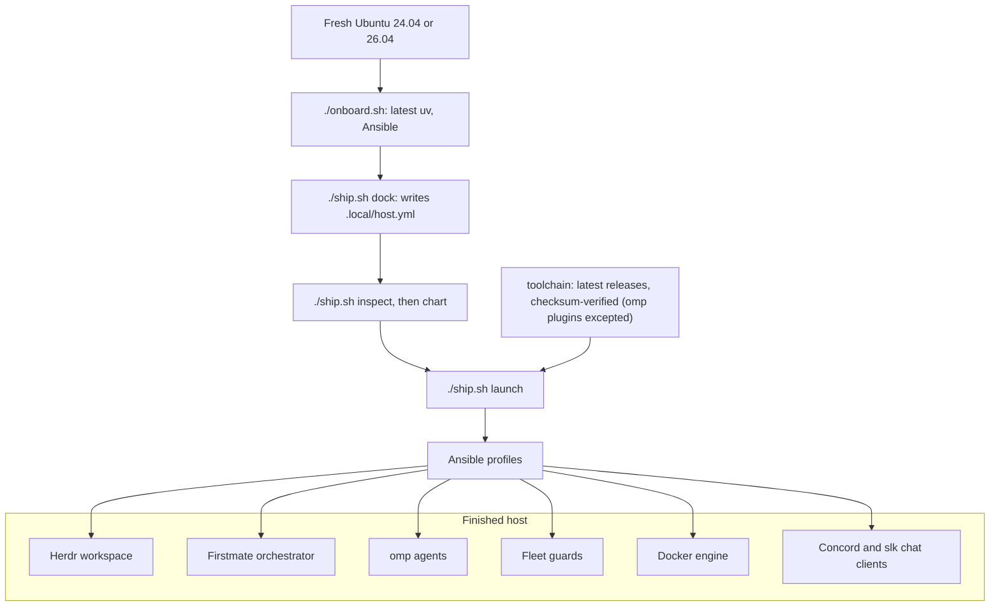

<div align="center">

# 🚢 Crewship

**Orchestrate hundreds of agents effortlessly - hardware is the limit.**

[](https://github.com/i098/Crewship/actions/workflows/ci.yml)
[](https://github.com/i098/Crewship/releases/latest)
[](LICENSE)
[](https://github.com/i098/Crewship/stargazers)
[](https://github.com/i098/Crewship/commits/main)
[](https://github.com/sponsors/i098)

[Docs](#docs) · [Install](#quick-start) · [Changelog](CHANGELOG.md) · [Discussions](https://github.com/i098/Crewship/discussions)


*A finished host: Herdr lists the workspaces and agents on the left, and omp agents work side by side.*

</div>

## Why Crewship

- **Self-hosted AI coding agents:** one Ubuntu 24.04 or 26.04 machine runs Herdr, the Firstmate orchestrator, and the omp agent fleet. No cloud dependencies.
- **Reproducible with Ansible:** profiles in one host file, a check-mode preview with `./ship.sh chart`, and one `./ship.sh launch` that changes the host. No Nix, no chezmoi.
- **Checksum-verified toolchain:** every apply installs the latest releases and verifies their checksums. The three omp marketplace plugins are the one exception.
- **Built for an agent fleet:** fleet guards, auto pruners, a self-hosted CI pool, and the Concord (Discord) and slk (Slack) terminal chat clients.

## Features

<details>
<summary><b>Show all features</b></summary>

- [Herdr workspace](docs/herdr.md): a sidebar of spaces and agents, with live status for each lane
- [omp agents](docs/omp.md): sign-in, model roles, fallbacks, and the advisor
- [Private skills](docs/omp.md#skills): host-only skills in `skills/private/` (opt-in)
- [Fleet guards](docs/fleet-guards.md): Docker guard, dev-server reaper, storage guard, spawn memory floor (opt-in)
- [Shared Postgres](docs/shared-postgres.md): one container, per-project databases and worktree connection strings (opt-in)
- [Browser ladder](docs/fleet-guards.md#browser-ladder): Obscura, Chrome, and noVNC tiers for agent browsers (opt-in)
- [Capacity and auto pruners](docs/capacity.md): host sizing per lane count, and cleanup timers
- [Data disk](docs/configuration.md#data-disk): Docker and the npm and pip caches on a second disk (opt-in)
- [Self-hosted CI pool](docs/ci-pool.md): GitHub Actions runners, one job per fresh container (opt-in)
- [Crew board](docs/board.md): host-local message board for agents on one host (opt-in)
- [Chat clients](docs/chat.md): Concord (Discord) and slk (Slack) in the terminal
- [GitHub board](docs/github-board.md): agent work as issues on a Project board, and a shared message board (opt-in)
- [iMessage bridge](docs/imessage.md): text Firstmate from your phone (opt-in)
- [Host-move checklist](docs/configuration.md#new-host-questions): new-host questions that follow your own checklist (opt-in)
- [Shared credentials](docs/secrets.md): `super.env` in Cloudflare Secrets Store
- [Google Workspace CLI](docs/google-workspace.md): `gws` with several Google accounts on a headless host
- [herdr-patch](herdr-patch/README.md): Herdr over mosh with real images
- [Checksum-verified toolchain](docs/dependencies.md): every tool, package, and image the recipe installs
- [Migration and recovery](docs/recovery.md): new-device sequence, desktop access, upgrades
- [Review desktop](docs/recovery.md#desktop-access): XFCE through loopback noVNC (opt-in)
- [Tailscale](docs/security.md#remote-access): the Tailscale daemon for remote access (opt-in)
- [SSH to a Mac](docs/security.md#ssh-to-a-mac): `ssh mac` from the host to your Mac (opt-in)
- [Agent host move](docs/agent-host-move.md): move the agents to a new host with parity checks
- [Security](docs/security.md): credential handling and remote access
</details>

<details>
<summary><b>Default config</b></summary>

- Agent harness: [omp](docs/omp.md), home model `anthropic/claude-opus-5-5:xhigh`, advisor off
- Models: dynamic per-task selection; small `anthropic/claude-haiku-5-5`, `openai-codex/gpt-6-luna`; ordinary (default) `anthropic/claude-sonnet-5-5`, `openai-codex/gpt-6.1-sol`; hard only `anthropic/claude-opus-5-5`.
- The spawning agent picks the thinking level.
- Codex context: 272K default, 1M maximum, `extendedContext` on.
  The current bundled omp catalog limits the effective maximum to 872K.
- omp plugins: `ponytail`, `i-have-adhd`, `caveman`
- omp extension `crewship-quality-gate`: [sentrux and fallow check](docs/omp.md#quality-gate) at each turn end
- omp extension `aa-mode-icons`: [mode and hook icons](docs/omp.md#status-line-icons) on the status line
- omp extension `crewship-herdr-sidebar`: topic, pane name, and PR line for the [Herdr sidebar](docs/herdr.md)
- omp extension `herdr-omp-agent-state`: Herdr's agent-state reporter
- omp extension `fm-no-pattern-kill`: blocks `pkill`, `killall`, and kill-by-`pgrep` commands
- Firstmate patch `0001-watch-wake-on-queued-inbox-note`: [wakes Firstmate](docs/dependencies.md#firstmate-patch-layer) on a queued inbox note
- Firstmate patch `0002-watch-end-idle-wait-for-inbox-note`: ends the idle wait within about 1 s for an inbox note
- Firstmate patch `0003-brief-crewboard`: adds the optional [crew board instructions](docs/board.md#firstmate-instructions)
- Hooks: `crewship-quality-gate` at omp turn end, SessionStart banners from `ponytail`, `i-have-adhd`, `caveman`, `ACTIONS_RUNNER_HOOK_JOB_STARTED` (opt-in with the [CI pool](docs/ci-pool.md))
- Pipeline gates: [no-mistakes](docs/omp.md#no-mistakes-pipeline-agent) and `ponytail-review`
- Gate models: per-run pins; routine `openai-codex/gpt-6.1-sol:medium`; ordinary (default) `anthropic/claude-sonnet-5-5:high`; hard `anthropic/claude-opus-5-5:high`.
  The verified Pi-only adapter preserves per-run model choices and fails on wrapper refusal.
- Skills and rules: [`skills/`](skills/) for omp and Claude Code, [`config/AGENTS.md`](config/AGENTS.md) for Claude Code, omp, and Codex; public files install with the `agents` profile and private files take precedence ([omp](docs/omp.md#skills)).
- omp rules ([TTSR](docs/omp.md#rules)): `always-on-skills`, `asd-ste100`, `use-native-stacked-prs`; with the browser ladder: `drive-the-browser-yourself`, `fleet-browser-default-tier`.
- Profiles on: `agents`, `development`, `firstmate`, `docker`, `chat`
- Profiles off (opt-in): `tailscale`, `desktop`, `fleet_guards`, `shared_postgres`, `fleet_browsers`
- Unset (opt-in): `data_dir`, `firstmate.checklist`, `mac_ssh`, `skills`, `imessage`, `github_board`, `board`, `ci_pool`
- Full files: [`config/default.yml`](config/default.yml), [`config/omp.yml`](config/omp.yml)

</details>

## How it works



## Quick start

### Get a machine

Rent an Ubuntu 24.04 or 26.04 server from any VPS or cloud provider, for example [Hetzner Cloud](https://www.hetzner.com/cloud/), [OVHcloud VPS](https://www.ovhcloud.com/en/vps/), or [DigitalOcean Droplets](https://www.digitalocean.com/products/droplets). A spare machine at home works too.

Runs on 4 vCPU / 16 GB and up; a 96 vCPU / 247 GB host ran 37 agents in about 67 GB RAM ([Capacity](docs/capacity.md)).

### Install

With curl:

```bash
curl -fsSL https://raw.githubusercontent.com/i098/Crewship/main/install.sh | bash
```

With npx:

```bash
npx crewship
```

With bunx:

```bash
bunx crewship
```

With pnpm:

```bash
pnpm dlx crewship
```

Sign in to GitHub:

```bash
gh auth login
```

[Sign in to omp](docs/omp.md#sign-in):

```bash
omp
```

<details>
<summary>Manual Quick Start</summary>

You need Ubuntu 24.04 or 26.04 on x86_64 or aarch64 with systemd, a non-root account with sudo, Python 3.12+, `git`, and `gh`. [`cloud-init/user-data.yaml`](cloud-init/user-data.yaml) can preinstall the OS packages on first boot.

1. Authenticate GitHub (for private repositories and gh-axi):

   ```bash
   gh auth login
   ```

2. Clone the repository:

   ```bash
   git clone https://github.com/i098/Crewship.git
   cd Crewship
   ```

3. Install the repository tooling (the latest uv, then the locked Python environment with Ansible):

   ```bash
   ./onboard.sh
   ```

4. Create your host config, then review its profiles, user, and paths:

   ```bash
   ./ship.sh dock
   ${EDITOR:-nano} .local/host.yml
   ```

5. Validate the config and preview the changes.
   `chart` uses Ansible check mode; the first config read can rewrite old keys and keep a backup:

   ```bash
   ./ship.sh inspect
   ./ship.sh chart
   ```

6. Launch to provision the host; this step may ask for your sudo password. With the `firstmate` profile on, the first successful interactive apply after you sign in to omp opens the [new-host questions](docs/configuration.md#new-host-questions); a fresh host's first apply installs omp, so sign in to omp after it and rerun apply:

   ```bash
   ./ship.sh launch
   ```

7. Check the result:

   ```bash
   ./ship.sh survey
   ```

Then authenticate the agent CLIs on this account; for omp, follow [Sign in](docs/omp.md#sign-in). Credentials are never copied from another host; see [Migration and recovery](docs/recovery.md).

</details>

## More docs

- [Architecture](docs/architecture.md)
- [Contributing](CONTRIBUTING.md)
- [Support](SUPPORT.md)
- [Report a bug](../../issues/new?template=bug_report.yml)
- [Request a feature](../../issues/new?template=feature_request.yml)
- [Pull request template](.github/PULL_REQUEST_TEMPLATE.md)
- [Security](SECURITY.md)
- [Code of conduct](CODE_OF_CONDUCT.md)
- [License: FSL-1.1-Apache-2.0](LICENSE)

## Built with

Built on Herdr, Firstmate, omp, Ansible and more: see [CREDITS.md](CREDITS.md).

## Sponsors

If Crewship saves you time, sponsor its development on GitHub.

<a href="https://github.com/sponsors/i098"></a>

<!-- The sponsors workflow writes the sponsor list between these markers; the line below is FALLBACK in scripts/sponsors.py. -->
<!-- sponsors -->
No sponsors yet. Be the first, and your name goes here.
<!-- /sponsors -->

## Star history

<a href="https://star-history.com/#i098/Crewship&Date">
  <picture>
    <source media="(prefers-color-scheme: dark)" srcset="https://api.star-history.com/svg?repos=i098/Crewship&type=Date&theme=dark">
    <source media="(prefers-color-scheme: light)" srcset="https://api.star-history.com/svg?repos=i098/Crewship&type=Date">
    
  </picture>
</a>
